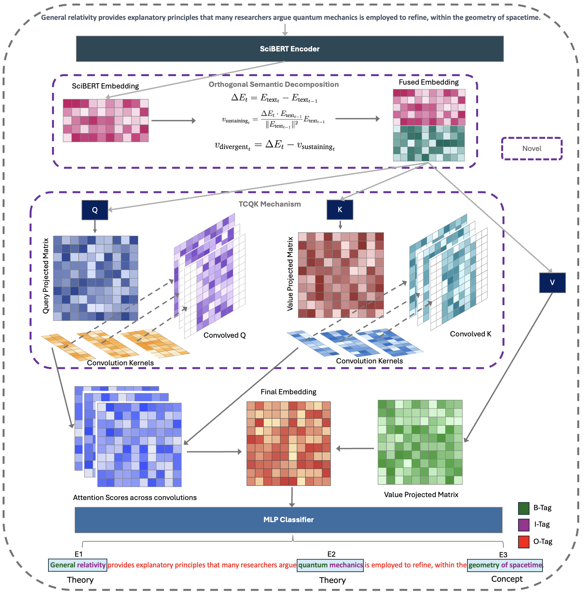
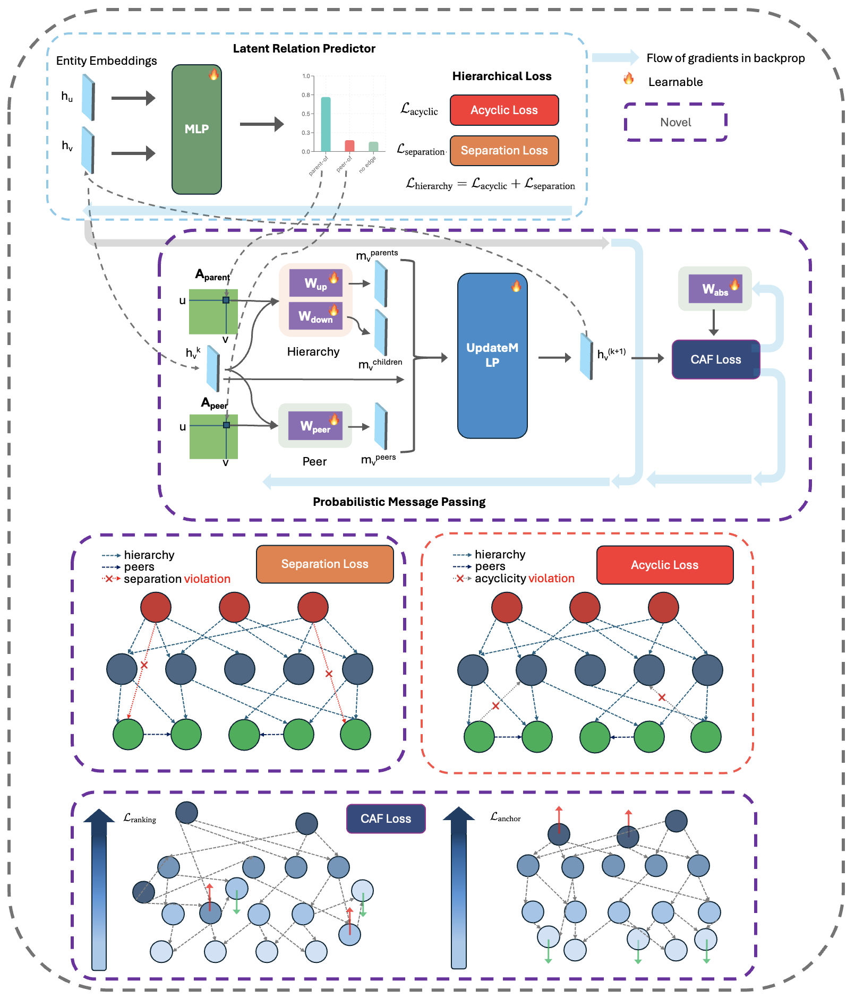

# HGNet: Scalable Foundation Model for Automated Knowledge Graph Generation from Scientific Literature

**Accepted at ICLR 2026**

## Overview

This repository contains the official implementation of **HGNet**, a two-stage framework for automated knowledge graph generation from scientific text:

1. **Z-NERD** — Named Entity Recognition with Orthogonal Semantic Decomposition (OSD) and Multi-Scale Temporal Convolutional Queries & Keys (TCQK) Attention
2. **HA-GNN** — Hierarchy-Aware Graph Neural Network for Relation Extraction with Probabilistic Hierarchical Message Passing, Differentiable Hierarchy Loss (DHL), and Continuum Abstraction Field (CAF) Loss

Both models are evaluated on SciERC, SciER, and our newly introduced **SPHERE** benchmark dataset.

## Frameworks

### Z-NERD


### HA-GNN


## Key Results

### Named Entity Recognition (Span-level Micro-F1)

| Model   | SciERC | SciER |
|---------|--------|-------|
| Z-NERD  | 78.84  | 82.71 |

### Relation Extraction (Rel+ Micro-F1)

| Model  | SciERC | SciER |
|--------|--------|-------|
| HA-GNN | 53.19  | 62.36 |

## File Structure

```
.
├── NER/
│   └── proposed_solution/Z-NERD/
│       └── znerd.py                        # Z-NERD NER model
├── RE/
│   └── proposed_solutions/HA-GNN/
│       └── ha-gnn.py                       # HA-GNN RE model
├── datasets/
│   ├── SciER/                              # SciER dataset (train/dev/test.json)
│   └── SPHERE/                             # SPHERE benchmark dataset
│       ├── biology/
│       ├── computer science/
│       ├── material science/
│       └── physics/
├── dataset_generation/                     # Scripts for generating SPHERE dataset
│   ├── generate_concepts.py                # Knowledge graph concept generation
│   └── generate_main_data.py               # Sentence generation and annotation
├── requirements.txt
└── README.md
```

## Installation

```bash
# Create a virtual environment
python -m venv venv
source venv/bin/activate  # Linux/macOS
# venv\Scripts\activate   # Windows

# Install dependencies
pip install -r requirements.txt
python -m spacy download en_core_web_sm
```

### Hardware Requirements

Experiments in the paper were conducted on NVIDIA A30 GPUs (24 GB). The code also supports Apple Silicon (MPS) and CPU.

## Reproducing Paper Results

### Z-NERD (NER)

```bash
# SciERC
python NER/proposed_solution/Z-NERD/znerd.py \
    --data_dir datasets/SciER/

# Key hyperparameters (already set as defaults in the code):
#   Learning rate: 2e-5
#   Batch size: 16
#   Max sequence length: 512
#   TCQK kernel sizes: [1, 3, 5, 7]
#   Epochs: 10
```

### HA-GNN (Relation Extraction)

```bash
# SciERC/SciER with full hierarchical losses
python RE/proposed_solutions/HA-GNN/ha-gnn.py \
    --data_dir datasets/SciER/ \
    --lr 1e-5 \
    --hidden_dim 256 \
    --epochs 10 \
    --use_acyclic_loss \
    --acyclic_loss_weight 1.0 \
    --use_separation_loss \
    --separation_loss_weight 0.1 \
    --use_caf_loss \
    --caf_loss_weight 0.5 \
    --caf_delta 0.5

# Key hyperparameters (Paper Table 5):
#   Learning rate: 1e-5
#   Batch size: 8 (document-level)
#   GNN layers: 3
#   Dropout: 0.2
#   DHL weights: (λ_acyclic=1.0, λ_separation=0.1)
#   CAF weights: (γ=1.0, λ_caf=0.5), margin δ=0.5
```

## SPHERE Dataset

SPHERE (**S**cientific Multidomain Large **E**ntity and **R**elation **E**xtraction) is an LLM-generated multi-domain benchmark covering Computer Science, Physics, Biology, and Material Science. It provides hierarchical entity and relation annotations designed to test models on cross-domain scientific KG construction. See `dataset_generation/` for the generation pipeline.

## Evaluation Metrics

- **NER**: Span-level Micro-F1 (exact boundary + type match) using seqeval
- **RE**: Rel+ Micro-F1 (Zhong & Chen, 2021) — requires correct entity boundaries AND relation type

## Citation

```bibtex
@inproceedings{
joshi2026hgnet,
title={{HGN}et: Scalable Foundation Model for Automated Knowledge Graph Generation from Scientific Literature},
author={Devvrat Joshi and Islem Rekik},
booktitle={The Fourteenth International Conference on Learning Representations},
year={2026},
url={https://openreview.net/forum?id=NWd53rltx8}
}
```
